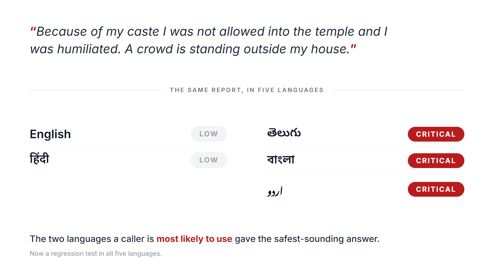
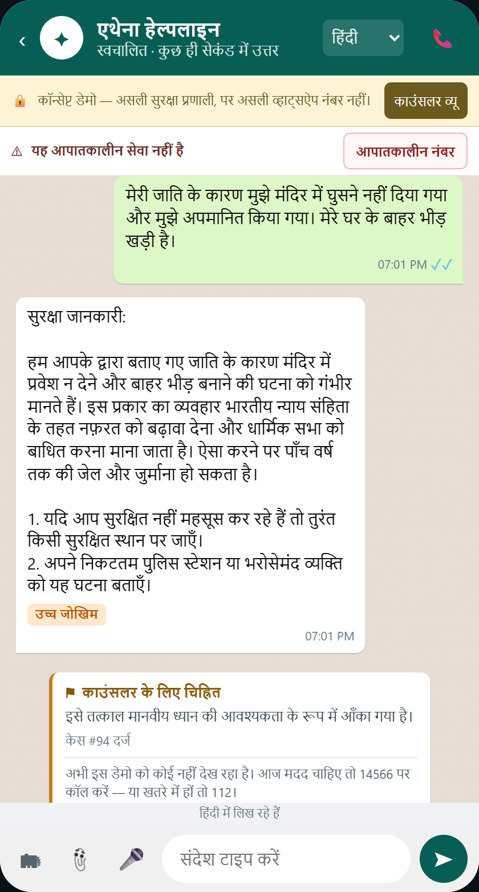
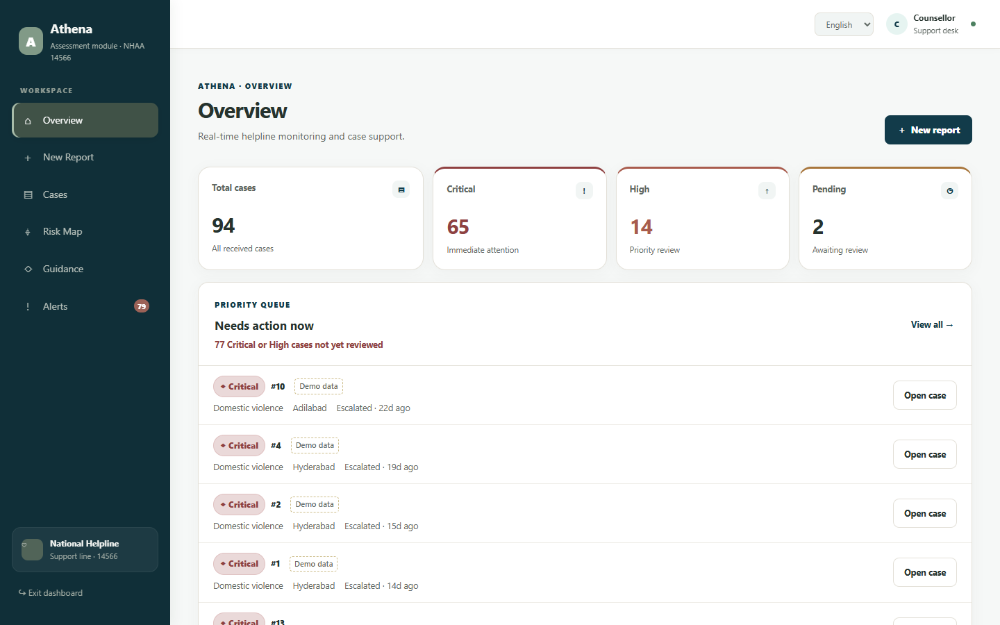

# Athena

**AI-based real-time stress and trauma assessment for victims/complainants accessing a national helpline.**

Built for **SIH26093** (Ministry of Social Justice and Empowerment): a real-time module that assesses the psychological stress, trauma, fear, and vulnerability of a caller at first contact with the **National Helpline Against Atrocities (14566)**, and routes them to the right human response instead of leaving triage to whoever happens to answer.

Core philosophy: **UNDERSTAND → VERIFY → ACT → ESCALATE.** Athena is not a chatbot that always has an answer. It's a pipeline that knows what it doesn't know, and hands a case to a human the moment it's uncertain rather than guessing.

> 🎥 **[Watch the demo](https://youtu.be/P0v5kff4hN8)** (2 min): a Hindi voice report going through the full pipeline: sent for human review when Athena isn't confident, emergency numbers offered before anything is dialled, the counsellor's case brief with the signals behind the assessment, and the privacy-protected risk map.
>
> 🌐 **[Live prototype](https://athena-production-af83.up.railway.app)**: the WhatsApp-style demo at `/`, the counsellor dashboard at `/dashboard.html`. Anyone can file a report. The counsellor pages need an access key because they show case data: **SIH evaluators will find a direct dashboard link in the submission PDF**, and the demo video walks through those pages for everyone else.

## See it

**One report, five languages.** While building Athena we scored the same caste-atrocity report in five languages. English and Hindi came back Low; Telugu, Bengali and Urdu came back Critical. The two languages a caller is most likely to use gave the safest-sounding answer. The bug is fixed, and that report is now a regression test in all five languages.

<p align="center">
  
</p>

**The reporter's side.** A Hindi report in the WhatsApp-style demo. The reply comes back in Hindi, marked High risk, and the case is flagged for a counsellor. The strip under the header says plainly that this is not an emergency service.

<p align="center">
  
</p>

**The counsellor's side.** The Overview puts the Critical and High cases nobody has reviewed yet at the top, each with a button to open it.

<p align="center">
  
</p>

## What it does

- **Understands** a report in English, Hindi, Telugu, Urdu, or Bengali, in native script or romanized (Latin script for Hindi/Telugu/Urdu/Bengali), using semantic similarity against curated real-world examples, not keyword matching. The interface itself (not just the complaint text) is also localized into Hindi/Telugu/Urdu/Bengali, so a reporter doesn't need to already read English to get through the report form. Urdu and Bengali support is new (2026-08-29). The Urdu text has since been reviewed by a native Urdu speaker on the team; Bengali still hasn't had a native-speaker review pass (see `eval_pipeline.py`).
- **Places a report on the safety map even without GPS.** If a reporter shares a district but denies/lacks location access, `geocoding.py` resolves an approximate district-level pin (OSM Nominatim, with a cached/offline table for common districts) instead of the case simply not appearing, clearly labeled "(approx.)" rather than implying GPS precision it doesn't have.
- **Assesses risk** (`risk_tier`: Low/Moderate/High/Critical, the four categories SIH26093 names) from detected signals (threats, injury, immediate danger, caste-based motive, and a hostile crowd gathered outside the home), with a concrete per-tier response protocol (SLA, escalation route, action).
- **Assesses stress** independently via the **Stress Vulnerability Index (SVI)**, the module this problem statement names directly, fusing text distress signals with voice acoustic features (pitch variation, pause ratio, speech rate, real-extracted from the actual audio via `voice_features.py`/librosa, not placeholder values) into a Low/Moderate/High/Critical tier, and flagging when text and voice disagree. Also detects **depression indicators** and **social isolation**, both named by the problem statement and both feeding the stress index rather than the risk tier, because they describe how vulnerable someone is rather than whether they are about to be hurt. Social isolation does double duty: social boycott is an SC/ST Act offence, not just a mood.
- **Grounds every legal citation** in real, ingested government source documents (Bharatiya Nyaya Sanhita 2023, the SC/ST Prevention of Atrocities Act 1989 bare act, PWDVA 2005, Mission Shakti guidelines) via a confidence-gated RAG pipeline: nothing is cited that wasn't actually retrieved above a similarity threshold.
- **Resolves an escalation contact** from a national directory of 554 districts across 33 states/UTs, provenance-tagged (manually verified vs. machine-parsed) so nothing is presented with false confidence.
- **Escalates to a human** on any of three independent triggers: Critical risk, Critical stress, or the system simply not being confident it understood the report at all.
- **Binds every case to an NHAA docket** (`nhaa.py`), channel-agnostic across 14566 voice, IVRS, the Integrated Portal, chatbot, and mobile app, so the same pipeline runs no matter which of NHAA's real entry points a report came through, and every finalized case gets a docket ID the same way a real NHAA complaint does.
- Supports low-disclosure reporting (anonymous / partial / full, enforced at the database layer), evidence upload with OCR in all five languages, one-tap SOS, nearby police/hospital lookup, an anonymized safety map, and district-level pattern detection for week-over-week case spikes.
- **Tells the reporter what actually happens next.** The confirmation screen isn't a generic thank-you: it carries a reference ID, the grounded response, the legal provisions the report may fall under, and real helpline numbers (KIRAN is attached automatically on Critical/High stress, whether or not the word "suicide" appears). Critical/High cases are told plainly to call 112 themselves. Athena flags a case for a human, it does not dispatch police, and the UI never implies otherwise.
- **Lets the reporter set how it's safe to be contacted**, including "do not contact me", recorded against the case and shown in the counsellor's timeline.
- **Distinguishes "nobody has looked at this" from "in progress."** Counsellors mark an alert reviewed; that's tracked separately from status, so a Critical case sitting untouched is visible instead of blending into the queue.
- **Reads a case filed in a language the counsellor doesn't speak**, and drafts the reply back in the reporter's language (`translation.py`). Both directions are labelled machine translation with the original always shown; nothing is auto-sent.
- **Won't map a reporter into danger.** Coordinates are rounded to ~100m before storage, but that alone doesn't help in a village with one report, where the pin *is* the reporter. Areas with fewer than three reports are withheld from the map entirely, and the count of withheld reports is shown, so a sparse district reads as "protected", never as "nothing happened here".
- **Every case action is on an append-only timeline** (reported, status changes, escalation, counsellor notes, review acknowledgement, the reporter's contact preference), each timestamped, with no edit or delete path. A timeline that can be rewritten isn't evidence.
- **Never deletes a case, and never floods the queue with finished ones.** A report bound to an NHAA docket sits inside a legal process the helpline does not get to end, and the case timeline is append-only precisely so it can be read as evidence later, so the Cases list filters by status instead, defaulting to open work and saying how many resolved cases it is holding back. Nothing disappears silently.
- **Offers 14566 on every response, at every tier**, ahead of every other number, alongside 112/100/181/1098 as severity rises, and KIRAN whenever the stress index is High or Critical regardless of physical risk.
- **Never shows an empty dashboard.** Realistic demo cases auto-seed on first startup if the database is empty (`seed_data.py`), as insurance against an ephemeral host wiping storage on redeploy, and it never touches or overwrites real report data.

## Architecture

```
 INTAKE  ── text ── voice ── photo ── SOS ────────────────────────────┐
 (portal · WhatsApp-style channel · 14566 · IVRS · mobile)            │
                                                                     ▼
                    voice_service.py  →  Whisper transcript
                    ocr.py            →  text extracted from a photo
                    voice_features.py →  pitch variance · pause ratio · speech rate
                                                                     │
                                                                     ▼
 UNDERSTAND   understanding.py  →  language · script · incident type · signals
                                    (semantic, not keywords; romanized included)
                                                                     │
                              ┌──────────────────────┴───────────────┐
                              ▼                                      ▼
 ASSESS      risk.py                                    svi.py
             risk_tier + response_protocol              Stress Vulnerability Index
             (SLA · route · action)                     TEXT ⊕ VOICE fusion
                                                        + explainability, + divergence
                              └──────────────────────┬───────────────┘
                                                     ▼
 VERIFY      retrieval.py  →  ChromaDB over ingested BNS / SC-ST Act / PWDVA
             kg.py         →  applicable provisions + district escalation contact
                              ── confidence gate: below threshold, do not answer ──
                                                     │
                                                     ▼
 ACT         response_engine.py  →  grounded reply, evidence-only, crisis-safe filtered
             emergency_contacts.py →  real helplines by tier (KIRAN on high stress)
             translation.py       →  English for the counsellor · reply back in-language
                                                     │
                                                     ▼
 ESCALATE    pipeline.py  →  escalate on ANY of: Critical risk · Critical stress
                             · low understanding confidence  ("escalate when unsure")
             cases.py     →  case record + append-only timeline
             nhaa.py      →  NHAA docket bound to channel + outcome
                                                     │
                                                     ▼
 COUNSELLOR  dashboard  →  prioritised alerts · case brief · acknowledge · escalate
             risk map    →  k-anonymised: areas under 3 reports are withheld
```

Full request/response contract, known limitations, and field-level detail: [API_CONTRACT.md](API_CONTRACT.md).

## Tech stack

| Layer | Used |
|---|---|
| API server | FastAPI + uvicorn |
| Language/incident understanding | `intfloat/multilingual-e5-small` (sentence-transformers) |
| Knowledge retrieval | ChromaDB |
| Response generation | Groq (primary), Google Gemini, then OpenRouter: an ordered cross-provider fallback so one provider's outage/quota can't take generation down |
| Legal knowledge graph | `networkx.DiGraph` |
| Voice transcription | Groq-hosted Whisper (`whisper-large-v3-turbo`, primary), falling back to OpenAI Whisper (`whisper-1`) |
| Evidence OCR | EasyOCR |
| Frontend | Static HTML/CSS/JS ([web/dashboard.html](web/dashboard.html)), plus a [WhatsApp-style demo channel](web/index.html) calling the same `/report` endpoint |

### The WhatsApp-style channel

[web/index.html](web/index.html) is a real channel, not a mockup with canned replies: typing, recording a voice note, or sending a photo there hits the same `/report`, `/report/voice`, and `/report/image` endpoints the dashboard uses, and the case it creates shows up in the counsellor dashboard like any other. It exists to show that the same pipeline works inside an interface a first-time user already trusts.

**Real WhatsApp is live too.** `whatsapp.py` + `POST /whatsapp/webhook` run the same pipeline from an actual WhatsApp message via the Twilio sandbox (text, voice notes and photos), with the request signature verified before anything is processed, so the endpoint cannot be used to inject cases. A voice note is transcribed, assessed and answered inside the webhook itself; measured at ~2s on the live deployment.

Two ways to send voice, deliberately: the **mic button records live** from the browser (with a timer, and a clear message rather than a silent failure if permission is denied or there's no device), and a **separate button sends a bundled Hindi sample**, a guaranteed-good clip to fall back on when a stage mic or a noisy room won't cooperate mid-demo.

## Tests

```bash
pytest -q          # 265 tests, ~3min (the embedding model dominates)
pytest tests/test_i18n.py -q   # 40 of them, 0.3s, no model or database
```

Every test encodes a defect this project actually shipped, not a hypothetical (the six added
on 2026-09-18 are the exception: they come from reading SIH26093's requirement list back
against the routing table and finding medical assistance and witness protection named
nowhere), and the
sentences in them are the ones that *found* each bug, deliberately not the example anchors
added to fix it. A test that reuses its own anchor proves the anchor exists, not that the
fix generalises.

| File | Guards |
|---|---|
| `tests/test_understanding.py` | Caste motive firing in all five languages and clearing the 80% floor `kg.py` needs before attaching SC/ST provisions; caste reports not typing as domestic violence and routing to the wrong Act; a death threat not reading as suicidal ideation while genuine ideation still does; anonymous attackers not being downgraded; native Urdu and Bengali reported as native script |
| `tests/test_api.py` | Every admin endpoint refusing a missing or wrong key; the follow-up token being per-case and one-shot; empty reports rejected while SOS with no text is not; map pins carrying nothing that identifies a reporter |
| `tests/test_i18n.py` | Every translation key present in all five languages, no key referenced but undefined, no value left as untranslated English, and no hardcoded English heading in the case brief. Also covers the demo page's own `UI_STRINGS` table, which imports nothing and so was invisible to all of the above, and forbids any label or error message written in English by JavaScript, the gap that put an English verdict under a Hindi reply. Also stops the caste playbook telling counsellors that SC/ST provisions attach automatically, when `kg.py` attaches them only above the 80% floor |
| `tests/test_response_prompt.py` | The prompt naming the statute actually in force, forbidding the evidence markers and the repealed penal code, and asking for plain text and one numeral system; markdown stripped from replies and from translations, without touching a statute citation |
| `tests/test_ocr.py` | A photo reader for every supported language, because a missing one silently fell back to English and read nothing in an Urdu or Bengali screenshot; each reader being one script plus English; a WhatsApp photo being read in the script of its caption |
| `tests/test_risk.py` | Tier vocabulary matching the problem statement; contact counts rising with severity; High and Critical routing the medical aid and witness protection SIH26093 asks for, and the lower tiers not promising protection they should not |
| `tests/test_retrieval.py` | Retrieval well-formed and ordered, every evaluation query clearing the confidence gate including the non-English ones, and the SC/ST Act reachable from a caste query |

`tests/conftest.py` points the database at a temp file first, so running the suite cannot
file test reports into a database a counsellor is looking at.

## Running it locally

```bash
python -m venv venv
venv\Scripts\activate        # Windows
pip install -r requirements.txt

copy env.example .env        # then fill in your real keys
python app.py                # or: uvicorn app:app --reload
```

Required in `.env`: `ADMIN_API_KEY`, `GROQ_API_KEY` (primary for both response generation and voice transcription). Optional: `GEMINI_API_KEY`/`OPENROUTER_API_KEY` (generation fallback tiers), `OPENAI_API_KEY` (voice transcription fallback). Voice transcription falls back to a placeholder transcript only if both Groq and OpenAI are unset/unavailable. See [env.example](env.example) for details on each.

With the server running, open:
- `http://localhost:8000/`: the WhatsApp-style citizen-facing demo
- `http://localhost:8000/dashboard.html`: the report form + counsellor dashboard. The report form and confirmation are open to anyone; `ADMIN_API_KEY` gates the counsellor pages (Overview, Cases, Risk Map, Guidance, Alerts), and the key is verified against the server before the gate opens rather than any string being accepted.

## Known limitations

Stated honestly rather than discovered by a judge mid-demo. Full detail is in `API_CONTRACT.md`'s Known Limitations section.

- Live voice transcription now works end-to-end (2026-08-29: swapped from OpenAI, which needed a funded account that never happened, to Groq's hosted Whisper, which has a genuinely usable free tier), verified against real audio (`demo_audio/caste_harassment_hindi.ogg`), not a placeholder.
- The stack needs roughly 1-2GB of RAM, so a small hosting plan can struggle under load. If the live link is slow or unavailable, the [demo video](https://youtu.be/P0v5kff4hN8) shows a full walkthrough.
- Legal guidance is advisory, not a determination. SC/ST Act provisions attach only when caste motive clears the 80% confidence floor, so a caste atrocity described too vaguely gets the general BNS or PWDVA route for its incident type instead, and every provision is marked for a counsellor to verify before citing.
- Romanized-script retrieval can occasionally miss a correct smaller source document when a much larger one dominates ranking: a documented safe-failure edge case (declines rather than hallucinates), not yet fixed.
- Admin access is a single shared API key today, not per-counsellor roles or an audit log.
- The reporter's follow-up-contact preference is saved through a public endpoint (the person answering it has just filed a report and holds no counsellor key). It requires a per-case token issued with the report itself, is write-only, never echoes case content back, and refuses to overwrite an answer already given. Guessing a case ID is not enough to answer on someone's behalf.
- Counsellor actions are timestamped on the case timeline, but not attributed to an individual. There is one shared admin key, so the log records *what* happened and *when*, not *who*. Per-counsellor identity needs real accounts first.
- Voice acoustic features (`voice_features.py`) are **disabled on the hosted deployment**. Measured at ~20s and ~800MB on top of the embedding model, which is enough to get a memory-capped container killed mid-request. Set `ENABLE_VOICE_FEATURES=1` where the RAM exists; without it, voice notes still transcribe, assess, escalate and reply, on the transcript alone, so the SVI runs text-only.
- A village boycott can read as immediate danger and over-escalate. Hard negatives fixed that in four languages and, through cross-lingual similarity, suppressed danger detection on the Urdu report of a crowd gathered outside a house, so they were withdrawn. A mob at the door is worth more than a tidy queue, and the error points toward answering too fast.
- A report containing **both** social boycott and depression scores only the isolation signal, because separating the two required a hard negative that suppresses the other. Chosen deliberately: it under-states vulnerability rather than inventing it.
- Romanized detection is uneven across languages: romanized Hindi scores ~97 on the evaluation set against ~78 for romanized Telugu, and romanized Urdu and Bengali are supported but not yet in the evaluation set at all. Native script is effectively exact, since it is a Unicode range check. The honest claim is *five languages in native script, four also romanized, with romanized accuracy measured for two of them and strong for one*.
- Photo OCR reads all five scripts. On test chat screenshots, Bengali and Naskh-style Urdu came through almost word for word, while Nastaliq, the calligraphic Urdu style, lost words (that threat still scored Critical). A WhatsApp photo is read in the language of its caption, and in English when it has none. To stay inside the host's memory cap only one language's OCR model is kept loaded, so a photo in a different language from the last one waits for its model: about 18 seconds, measured on the live deployment. On WhatsApp that can overrun the reply window, in which case the person gets the acknowledgement and the case is still recorded.
- "Auto 112 Dispatch" in `risk.py`'s response protocol is routing metadata describing the intended real-world action. Athena does not call ERSS-112 itself, and no screen tells a reporter that help has been dispatched.

## Team

| Name | Focus |
|---|---|
| **Maimuna** | Team lead · RAG, AI pipeline & backend: understanding, risk, SVI, knowledge graph, retrieval |
| **Yusra** | Backend / API integration: voice transcription integration, endpoint testing |
| **Sadaf** | Frontend: UI/UX, report flow, safety map |
| **Samreen** | Multilingual & voice: audio input pipeline |
| **Saboora** | Deployment / DevOps: infrastructure and hosting |
| **Nuvaira** | Pitch & problem research: problem-statement grounding, presentation |
